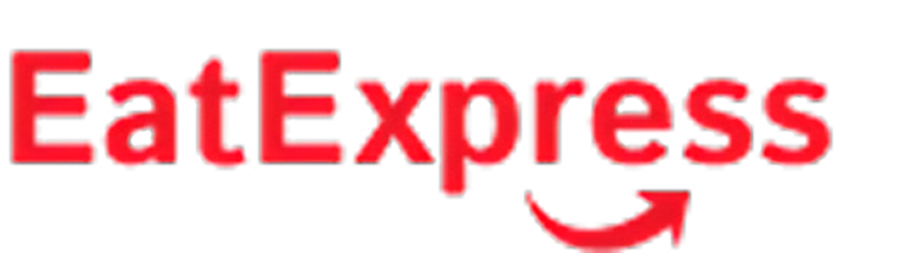

 

<h3 align="center" style='margin-bottom: 32px'>
Eat Express is a app inspired by iFood. It offers easy food ordering with category browsing, detailed restaurant and product pages. Built with Next.js and Prisma for fast performance and reliable data management.

</h3>

## 🚀 Technologies

- [Next.js](https://nextjs.org/) - The React framework for production.
- [Shadcn](https://ui.shadcn.com/) - A components library built with shadcn and Tailwind CSS.
- [Tailwind CSS](https://tailwindcss.com/) - A utility-first CSS framework for rapid UI development.
- [Prisma](https://www.prisma.io/) - Next-generation ORM for Node.js and TypeScript.
- [TypeScript](https://www.typescriptlang.org/) - Typed superset of JavaScript that compiles to plain JavaScript.

## 🛠 Key Features

- **Next.js Framework:** Experience fast and optimized performance with server-side rendering and static site generation provided by Next.js.

- **Prisma Integration:** Benefit from robust data handling with Prisma, ensuring efficient database queries and management.

- **Responsive Mobile Web App:** Seamless experience on mobile devices with a fully responsive design that adapts to any screen size.

- **Category Browsing:** Easily navigate through various food categories to find exactly what you're craving.

- **Restaurant Pages:** Explore detailed restaurant pages

- **Product Pages:** View comprehensive product details, including ingredients, prices, and availability, to help you decide on your next meal.

 

  <h3 align='center'> Developed By Pedro Arruda </h3> 
  
 
    
    
    
  

<h3 align='center'>Feel free to reach out for any questions or collaboration opportunities!
 </h3>
